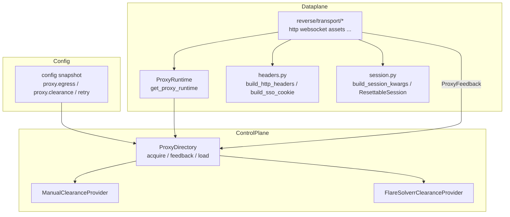

# Cloudflare clearance: deep dive and porting guide

This document explains **why** Grok2API cares about Cloudflare, **how** this repository implements egress, TLS impersonation, cookie clearance, and failure feedback, and **how** to reproduce the same design in another language or product. It points to concrete source locations so you can follow the implementation one step at a time.

---

## 1. What problem are we solving?

`grok.com` is commonly fronted by **Cloudflare**. Cloudflare evaluates each request using signals such as:

- **TLS fingerprint** (does the handshake look like a real browser or like a generic HTTP library?)
- **HTTP headers** (User-Agent, Accept, client hints, consistency with the claimed browser)
- **Cookies** (including challenge artifacts such as `cf_clearance` when a JavaScript challenge has been satisfied)
- **IP reputation and rate** (datacenter VPNs, abused subnets, burst traffic)

The gateway in this repo is **not** a first-party Grok SDK. It issues HTTP/WebSocket/gRPC-style calls **as an automated client**. If those calls do not look like a coherent browser session, upstream may return **403**, **429**, HTML challenge pages (“Just a moment…”), or other errors instead of JSON.

**Important:** Nothing here guarantees bypass in all environments. Bad egress IP or policy changes can still block you. The code tries to **align** your traffic with what Cloudflare expects from a browser.

---

## 2. End-to-end architecture in this repository

At a high level:

1. **Configuration** defines egress (direct vs proxy) and clearance mode (`none`, `manual`, `flaresolverr`).
2. **`ProxyDirectory`** (control plane) picks a proxy URL (if any) and builds or reuses a **`ClearanceBundle`** (cookies + User-Agent) per **affinity key** (proxy URL or `"direct"`).
3. Callers obtain a **`ProxyLease`** for each logical request batch, then the **dataplane** builds **curl_cffi** sessions and headers using that lease.
4. After the response, **`proxy.feedback`** may mark the clearance bundle **invalid** so the next `acquire` refreshes cookies (when using FlareSolverr) or forces you to update manual config.



### Startup hook

The FastAPI lifespan initializes the proxy directory once per process:

```176:178:app/main.py
    # 5. Initialise proxy directory.
    from app.control.proxy import get_proxy_directory
    await get_proxy_directory()
```

The dataplane uses a thin **`ProxyRuntime`** facade so transports call `acquire` / `feedback` without importing control internals directly:

```14:30:app/dataplane/proxy/__init__.py
class ProxyRuntime:
    """Hot-path facade around ProxyDirectory."""

    def __init__(self, directory: ProxyDirectory) -> None:
        self._dir = directory

    async def acquire(
        self,
        *,
        scope:    ProxyScope  = ProxyScope.APP,
        kind:     RequestKind = RequestKind.HTTP,
        resource: bool        = False,
    ) -> ProxyLease:
        return await self._dir.acquire(scope=scope, kind=kind, resource=resource)

    async def feedback(self, lease: ProxyLease, result: ProxyFeedback) -> None:
        await self._dir.feedback(lease, result)
```

---

## 3. Configuration reference (keys and defaults)

All defaults live in [`config.defaults.toml`](../config.defaults.toml). Runtime values may be overridden by your deployment config or Admin UI.

### 3.1 Egress (`[proxy.egress]`)

| Key | Purpose |
|-----|---------|
| `mode` | `direct` — no outbound proxy; `single_proxy` — one `proxy_url`; `proxy_pool` — rotate `proxy_pool`. |
| `proxy_url` / `proxy_pool` | Where **API** traffic exits (must match where clearance cookies were obtained when using CF). |
| `resource_proxy_url` / `resource_proxy_pool` | Optional separate path for **media downloads**; falls back to primary proxy settings when empty. |
| `skip_ssl_verify` | Disables TLS verification **to the proxy server** only (not a Cloudflare workaround). |

```51:63:config.defaults.toml
[proxy.egress]
# 出口模式：direct | single_proxy | proxy_pool
mode = "direct"
# 基础代理 URL（API 流量，single_proxy 模式必填）
proxy_url = ""
# 基础代理池（API 流量，proxy_pool 模式必填）
proxy_pool = []
# 资源代理 URL（图片/视频下载，未配置则回落到 proxy_url）
resource_proxy_url = ""
# 资源代理池（图片/视频下载，未配置则回落到 proxy_pool）
resource_proxy_pool = []
# 跳过代理 SSL 证书验证（代理使用自签名证书时启用）
skip_ssl_verify = false
```

### 3.2 Clearance (`[proxy.clearance]`)

| Key | Purpose |
|-----|---------|
| `mode` | `none` — no stored CF cookies; `manual` — static `cf_cookies` + `user_agent`; `flaresolverr` — obtain cookies via FlareSolverr. |
| `cf_cookies` | Full `Cookie` fragment string from a browser or solver (often includes `cf_clearance` and related names). |
| `user_agent` | Must **match** the browser profile that produced `cf_cookies`. |
| `browser` | curl_cffi **impersonate** profile name, e.g. `chrome136`; should align with JA3 expectations for that Chrome generation. |
| `flaresolverr_url` | Base URL of FlareSolverr (requests go to `{url}/v1`). |
| `timeout_sec` | Max time for FlareSolverr to solve a challenge (milliseconds are `timeout_sec * 1000` in the payload). |
| `refresh_interval` | Used by **`ProxyClearanceScheduler`** (see section 9), not by `ProxyDirectory` directly. |

```65:79:config.defaults.toml
[proxy.clearance]
# Cloudflare clearance 模式：none | manual | flaresolverr
mode = "none"
# 手动模式：Cloudflare Cookie 字符串
cf_cookies = ""
# User-Agent（需与 cf_cookies 匹配）
user_agent = "Mozilla/5.0 (Macintosh; Intel Mac OS X 10_15_7) AppleWebKit/537.36 (KHTML, like Gecko) Chrome/136.0.0.0 Safari/537.36"
# curl_cffi 浏览器指纹
browser = "chrome136"
# FlareSolverr 服务地址
flaresolverr_url = ""
# 挑战等待超时（秒）
timeout_sec = 60
# Clearance 刷新间隔（秒）
refresh_interval = 3600
```

### 3.3 Transport retry (`[retry]`)

| Key | Purpose |
|-----|---------|
| `reset_session_status_codes` | HTTP status codes that cause **`ResettableSession`** to **recreate** the underlying `curl_cffi` session on the next request (default includes **403**). |

```82:89:config.defaults.toml
# ==================== 重试策略 ====================
[retry]
# [Transport 层] 触发重建代理 Session 的 HTTP 状态码
reset_session_status_codes = [403]
# [App 层] 换账号重试最大次数（0 = 不重试）
max_retries = 1
# [App 层] 触发换账号重试的 HTTP 状态码，英文逗号分隔
on_codes = "429,401,503"
```

### 3.4 Docker hints

[`docker-compose.yml`](../docker-compose.yml) documents optional **FlareSolverr** and **Warp** services and environment variables such as `FLARESOLVERR_URL` / `CF_REFRESH_INTERVAL` / `CF_TIMEOUT` (see comments in that file). Align compose env names with whatever your deployment uses to populate the config snapshot.

---

## 4. Domain model (enums and structs)

Core types live in [`app/control/proxy/models.py`](../app/control/proxy/models.py).

### 4.1 Modes

```20:29:app/control/proxy/models.py
class EgressMode(StrEnum):
    DIRECT       = "direct"        # no proxy
    SINGLE_PROXY = "single_proxy"  # one fixed proxy URL
    PROXY_POOL   = "proxy_pool"    # rotate from a pool


class ClearanceMode(StrEnum):
    NONE         = "none"         # no CF clearance required
    MANUAL       = "manual"       # operator-supplied cf_cookies
    FLARESOLVERR = "flaresolverr" # maintained by FlareSolverr
```

### 4.2 Bundle, lease, feedback

- **`ClearanceBundle`**: stored cookies + UA + state (`VALID` / `STALE` / `INVALID`).
- **`ProxyLease`**: handed to transports for **one** logical operation; contains `proxy_url`, `cf_cookies`, `user_agent`.
- **`ProxyFeedback`**: result classification; `CHALLENGE` and `UNAUTHORIZED` invalidate the bundle.

```73:100:app/control/proxy/models.py
class ClearanceBundle(BaseModel):
    bundle_id:       str
    cf_cookies:      str            = ""
    user_agent:      str            = ""
    state:           ClearanceBundleState = ClearanceBundleState.VALID
    affinity_key:    str            = ""  # associates bundle with an egress node
    last_refresh_at: int | None     = None  # ms


class ProxyLease(BaseModel):
    lease_id:    str
    proxy_url:   str | None    = None
    cf_cookies:  str           = ""
    user_agent:  str           = ""
    scope:       ProxyScope    = ProxyScope.APP
    kind:        RequestKind   = RequestKind.HTTP
    acquired_at: int           = 0   # ms

    @property
    def has_proxy(self) -> bool:
        return bool(self.proxy_url)


class ProxyFeedback(BaseModel):
    kind:           ProxyFeedbackKind
    status_code:    int | None = None
    reason:         str        = ""
    retry_after_ms: int | None = None
```

---

## 5. `ProxyDirectory`: load, acquire, bundle cache, feedback

### 5.1 `load`

`load()` reads `[proxy.egress]` and `[proxy.clearance]` from the config snapshot and rebuilds the in-memory **egress node** lists. It does **not** automatically clear existing bundles unless you replace the directory instance.

```44:79:app/control/proxy/__init__.py
    async def load(self) -> None:
        """Load proxy configuration from the current config snapshot."""
        cfg = get_config()
        self._egress_mode    = EgressMode(cfg.get_str("proxy.egress.mode", "direct"))
        self._clearance_mode = ClearanceMode.parse(cfg.get_str("proxy.clearance.mode", "none"))

        nodes: list[EgressNode]          = []
        resource_nodes: list[EgressNode] = []

        if self._egress_mode == EgressMode.SINGLE_PROXY:
            base_url = cfg.get_str("proxy.egress.proxy_url", "")
            res_url  = cfg.get_str("proxy.egress.resource_proxy_url", "")
            if base_url:
                nodes.append(EgressNode(node_id="single", proxy_url=base_url))
            if res_url:
                resource_nodes.append(EgressNode(node_id="res-single", proxy_url=res_url))

        elif self._egress_mode == EgressMode.PROXY_POOL:
            base_pool: list[str] = cfg.get_list("proxy.egress.proxy_pool", [])
            res_pool:  list[str] = cfg.get_list("proxy.egress.resource_proxy_pool", [])
            for i, url in enumerate(base_pool):
                nodes.append(EgressNode(node_id=f"pool-{i}", proxy_url=url))
            for i, url in enumerate(res_pool):
                resource_nodes.append(EgressNode(node_id=f"res-pool-{i}", proxy_url=url))

        async with self._lock:
            self._nodes          = nodes
            self._resource_nodes = resource_nodes

        logger.info(
            "proxy directory loaded: egress_mode={} clearance_mode={} node_count={} resource_node_count={}",
            self._egress_mode,
            self._clearance_mode,
            len(nodes),
            len(resource_nodes),
        )
```

### 5.2 `acquire` and affinity

`acquire` picks `proxy_url` (or `None` for direct), computes **`affinity = proxy_url or "direct"`**, then `_get_or_build_bundle`:

```85:109:app/control/proxy/__init__.py
    async def acquire(
        self,
        *,
        scope:    ProxyScope  = ProxyScope.APP,
        kind:     RequestKind = RequestKind.HTTP,
        resource: bool        = False,
    ) -> ProxyLease:
        """Return a ProxyLease for the next request.

        For DIRECT mode, returns a lease with no proxy or clearance.
        """
        proxy_url = await self._pick_proxy_url(resource=resource)
        affinity  = proxy_url or "direct"

        bundle = await self._get_or_build_bundle(affinity_key=affinity, proxy_url=proxy_url or "")

        return ProxyLease(
            lease_id    = next_hex(),
            proxy_url   = proxy_url,
            cf_cookies  = bundle.cf_cookies if bundle else "",
            user_agent  = bundle.user_agent if bundle else "",
            scope       = scope,
            kind        = kind,
            acquired_at = now_ms(),
        )
```

**Why affinity matters:** Cloudflare cookies are typically bound to **IP / ASN / TLS context**. If you rotate proxies, each exit IP should have **its own** clearance bundle. This codebase keys bundles by `proxy_url` (or `"direct"`), which implements that separation.

### 5.3 `_get_or_build_bundle`

```145:171:app/control/proxy/__init__.py
    async def _get_or_build_bundle(
        self,
        *,
        affinity_key: str,
        proxy_url:    str,
    ) -> ClearanceBundle | None:
        if self._clearance_mode == ClearanceMode.NONE:
            return None

        async with self._lock:
            existing = self._bundles.get(affinity_key)
            if existing and existing.state.value == 0:   # VALID
                return existing

        if self._clearance_mode == ClearanceMode.MANUAL:
            bundle = self._manual.build_bundle(affinity_key=affinity_key)
        else:
            bundle = await self._flare.refresh_bundle(
                affinity_key = affinity_key,
                proxy_url    = proxy_url,
            )

        if bundle:
            async with self._lock:
                self._bundles[affinity_key] = bundle

        return bundle
```

Flow in words:

1. If `mode == none`, return `None` → lease has empty `cf_cookies` / `user_agent`.
2. If a **VALID** bundle exists for this affinity, reuse it.
3. Otherwise build from **manual** config or call **FlareSolverr**, then store.

### 5.4 `feedback` and invalidation

```111:125:app/control/proxy/__init__.py
    async def feedback(self, lease: ProxyLease, result: ProxyFeedback) -> None:
        """Apply upstream feedback to the appropriate egress node."""
        if result.kind in (
            ProxyFeedbackKind.CHALLENGE,
            ProxyFeedbackKind.UNAUTHORIZED,
        ):
            # Invalidate associated clearance bundle.
            affinity = lease.proxy_url or "direct"
            async with self._lock:
                bundle = self._bundles.get(affinity)
                if bundle:
                    from .models import ClearanceBundleState
                    self._bundles[affinity] = bundle.model_copy(
                        update={"state": ClearanceBundleState.INVALID}
                    )
```

So: after a **challenge** or **401 on proxy auth**, the next `acquire` will miss a `VALID` bundle and **refresh** (FlareSolverr) or re-read manual config.

---

## 6. Clearance providers

### 6.1 Manual mode

[`app/control/proxy/providers/manual.py`](../app/control/proxy/providers/manual.py) copies `proxy.clearance.cf_cookies` and `proxy.clearance.user_agent` into a `ClearanceBundle` when `mode == manual`.

```7:20:app/control/proxy/providers/manual.py
class ManualClearanceProvider:
    """Build a ClearanceBundle from static config values."""

    def build_bundle(self, *, affinity_key: str) -> ClearanceBundle | None:
        cfg = get_config()
        mode = ClearanceMode.parse(cfg.get_str("proxy.clearance.mode", "none"))
        if mode != ClearanceMode.MANUAL:
            return None
        return ClearanceBundle(
            bundle_id    = f"manual:{affinity_key}",
            cf_cookies   = cfg.get_str("proxy.clearance.cf_cookies", ""),
            user_agent   = cfg.get_str("proxy.clearance.user_agent", ""),
            affinity_key = affinity_key,
        )
```

**Operational recipe:** In a real browser (same proxy if you use one), complete any challenge, copy **all** relevant cookies as a `name=value; ...` string, paste into `cf_cookies`, and set `user_agent` to the **exact** UA string from that browser session.

### 6.2 FlareSolverr mode

[`app/control/proxy/providers/flaresolverr.py`](../app/control/proxy/providers/flaresolverr.py) POSTs JSON to FlareSolverr’s `/v1` API with `cmd: request.get` and `url: https://grok.com`. If you configured a proxy lease, the **same** `proxy_url` is passed so the challenge is solved **from the same egress** your app will use.

```67:114:app/control/proxy/providers/flaresolverr.py
    async def _solve(
        self,
        *,
        fs_url:      str,
        proxy_url:   str,
        timeout_sec: int,
    ) -> dict[str, str] | None:
        payload: dict = {
            "cmd":        "request.get",
            "url":        "https://grok.com",
            "maxTimeout": timeout_sec * 1000,
        }
        if proxy_url:
            payload["proxy"] = {"url": proxy_url}

        body    = json.dumps(payload).encode()
        request = urllib_request.Request(
            f"{fs_url.rstrip('/')}/v1",
            data    = body,
            method  = "POST",
            headers = {"Content-Type": "application/json"},
        )

        try:
            def _post() -> dict:
                with urllib_request.urlopen(request, timeout=timeout_sec + 30) as resp:
                    return json.loads(resp.read().decode())

            result = await asyncio.to_thread(_post)
            if result.get("status") != "ok":
                logger.warning(
                    "flaresolverr returned non-ok status: status={} message={}",
                    result.get("status"), result.get("message", ""),
                )
                return None

            solution = result.get("solution", {})
            cookies  = solution.get("cookies", [])
            if not cookies:
                logger.warning("flaresolverr returned no cookies")
                return None

            ua = solution.get("userAgent", "") or ""
            return {
                "cookies":    _extract_all_cookies(cookies),
                "user_agent": ua,
                "browser":    _browser_profile(ua),
            }
```

The returned `user_agent` is stored on the bundle and later used for HTTP headers; the **Chrome major version** in that UA is also used to derive the curl_cffi `chromeNNN` profile (see sections 7 and 8).

---

## 7. Headers and cookies (dataplane)

[`app/dataplane/proxy/adapters/headers.py`](../app/dataplane/proxy/adapters/headers.py) centralizes header construction.

### 7.1 Resolving profile from lease or config

```131:146:app/dataplane/proxy/adapters/headers.py
def _resolve_profile(lease: ProxyLease | None) -> tuple[str, str]:
    """Return (cf_cookies, user_agent) from lease or config."""
    if lease is not None:
        return (lease.cf_cookies or "", lease.user_agent or "")
    cfg = get_config()
    return (
        cfg.get_str("proxy.clearance.cf_cookies", ""),
        cfg.get_str("proxy.clearance.user_agent", ""),
    )


def _resolve_browser(lease: ProxyLease | None) -> str:
    if lease is not None and lease.user_agent:
        m = re.search(r"Chrome/(\d+)", lease.user_agent)
        return f"chrome{m.group(1)}" if m else "chrome120"
    return get_config().get_str("proxy.clearance.browser", "chrome120")
```

### 7.2 `build_sso_cookie`

Grok web auth uses SSO cookies; this helper **appends** Cloudflare-related cookies after the SSO pair:

```153:185:app/dataplane/proxy/adapters/headers.py
def build_sso_cookie(
    sso_token: str,
    *,
    lease:        ProxyLease | None = None,
    cf_cookies:   str | None = None,
    cf_clearance: str | None = None,
) -> str:
    """Build the Cookie header value for an SSO-authenticated request."""
    tok = sso_token[4:] if sso_token.startswith("sso=") else sso_token
    tok = _sanitize(tok, field="sso_token", strip_spaces=True)

    cookie           = f"sso={tok}; sso-rw={tok}"
    profile_cookies, _ = _resolve_profile(lease)
    eff_cookies      = _sanitize(cf_cookies if cf_cookies is not None else profile_cookies,
                                 field="cf_cookies")
    eff_clearance    = _sanitize(cf_clearance if cf_clearance is not None else "",
                                 field="cf_clearance", strip_spaces=True)

    if eff_clearance and eff_cookies:
        if re.search(r"(?:^|;\s*)cf_clearance=", eff_cookies):
            eff_cookies = re.sub(
                r"(^|;\s*)cf_clearance=[^;]*",
                r"\1cf_clearance=" + eff_clearance,
                eff_cookies, count=1,
            )
        else:
            eff_cookies = f"{eff_cookies.rstrip('; ')}; cf_clearance={eff_clearance}"
    elif eff_clearance:
        eff_cookies = f"cf_clearance={eff_clearance}"

    if eff_cookies:
        cookie += f"; {eff_cookies}"
    return cookie
```

### 7.3 `build_http_headers` and Chromium client hints

`build_http_headers` sets browser-like `Accept`, `Sec-Fetch-*`, `User-Agent`, optional **`Sec-Ch-Ua*`** hints (via `_client_hints`), and **`Cookie`** from `build_sso_cookie`:

```188:246:app/dataplane/proxy/adapters/headers.py
def build_http_headers(
    cookie_token: str,
    *,
    content_type: Optional[str] = None,
    origin:       Optional[str] = None,
    referer:      Optional[str] = None,
    lease:        ProxyLease | None = None,
) -> dict[str, str]:
    """Build headers for a standard HTTP reverse-proxy request."""
    _, raw_ua = _resolve_profile(lease)
    ua        = _sanitize(raw_ua, field="user_agent")
    browser   = _resolve_browser(lease)
    org       = _sanitize(origin  or "https://grok.com",  field="origin")
    ref       = _sanitize(referer or "https://grok.com/", field="referer")
    ...
    headers.update(_client_hints(browser, raw_ua))
    headers["Cookie"] = build_sso_cookie(cookie_token, lease=lease)
```

WebSocket upgrades use **`build_ws_headers`**, same profile resolution and `build_sso_cookie` when a token is present:

```249:274:app/dataplane/proxy/adapters/headers.py
def build_ws_headers(
    token:  Optional[str] = None,
    *,
    origin: Optional[str]             = None,
    extra:  Optional[dict[str, str]]  = None,
    lease:  ProxyLease | None         = None,
) -> dict[str, str]:
    """Build headers for a WebSocket upgrade request."""
    _, raw_ua = _resolve_profile(lease)
    ua        = _sanitize(raw_ua, field="user_agent")
    browser   = _resolve_browser(lease)
    org       = _sanitize(origin or "https://grok.com", field="origin")

    headers: dict[str, str] = {
        "Accept-Language": "zh-CN,zh;q=0.9,en;q=0.8",
        "Cache-Control":   "no-cache",
        "Origin":          org,
        "Pragma":          "no-cache",
        "User-Agent":      ua,
    }
    headers.update(_client_hints(browser, raw_ua))
    if token:
        headers["Cookie"] = build_sso_cookie(token, lease=lease)
    if extra:
        headers.update(extra)
    return headers
```

---

## 8. TLS impersonation and session reset

[`app/dataplane/proxy/adapters/session.py`](../app/dataplane/proxy/adapters/session.py) builds kwargs for **`curl_cffi.requests.AsyncSession`**.

### 8.1 `impersonate` and proxy wiring

```41:73:app/dataplane/proxy/adapters/session.py
def build_session_kwargs(
    *,
    lease:            ProxyLease | None = None,
    browser_override: str | None       = None,
    extra:            dict[str, Any] | None = None,
) -> dict[str, Any]:
    """Build kwargs suitable for ``curl_cffi.requests.AsyncSession``."""
    kwargs: dict[str, Any] = dict(extra or {})

    # Browser impersonation.
    if not kwargs.get("impersonate"):
        browser = browser_override or _resolve_browser(lease)
        if browser:
            kwargs["impersonate"] = browser

    # Proxy URL.
    proxy_url = ""
    if lease is not None and lease.proxy_url:
        proxy_url = normalize_proxy_url(lease.proxy_url)
        scheme = urlparse(proxy_url).scheme.lower()
        if scheme.startswith("socks"):
            kwargs.setdefault("proxy", proxy_url)
        else:
            kwargs.setdefault("proxies", {"http": proxy_url, "https": proxy_url})

    # curl SSL options for proxy.
    if _skip_proxy_ssl(proxy_url):
        opts = dict(kwargs.get("curl_options") or {})
        opts[CurlOpt.PROXY_SSL_VERIFYPEER] = 0
        opts[CurlOpt.PROXY_SSL_VERIFYHOST] = 0
        kwargs["curl_options"] = opts

    return kwargs
```

**SOCKS DNS note:** `normalize_proxy_url` rewrites `socks5://` → `socks5h://` so hostnames resolve **through** the proxy, which avoids subtle leaks and misrouting.

```29:37:app/dataplane/proxy/adapters/session.py
def normalize_proxy_url(url: str) -> str:
    """Remap socks5:// → socks5h:// for proper DNS-over-proxy."""
    if not url:
        return url
    scheme = urlparse(url).scheme.lower()
    if scheme == "socks5":
        return "socks5h://" + url[len("socks5://"):]
    if scheme == "socks4":
        return "socks4a://" + url[len("socks4://"):]
    return url
```

### 8.2 `ResettableSession`

After each request, if `response.status_code` is in `reset_session_status_codes` (default **403**), the next call recreates the session (new TLS connection pool behavior via a new `AsyncSession`):

```76:126:app/dataplane/proxy/adapters/session.py
class ResettableSession:
    """AsyncSession wrapper that resets connection on configurable status codes.

    Designed for long-lived hot-path use; session is recreated transparently
    when a reset-triggering status code is received.
    """

    def __init__(
        self,
        *,
        lease:           ProxyLease | None = None,
        browser_override: str | None       = None,
        reset_on_status: set[int] | None   = None,
        **session_kwargs: Any,
    ) -> None:
        self._kwargs = build_session_kwargs(
            lease            = lease,
            browser_override = browser_override,
            extra            = session_kwargs or None,
        )
        if reset_on_status is None:
            codes = get_config().get_list("retry.reset_session_status_codes", [403])
            reset_on_status = {int(c) for c in codes}
        self._reset_on = reset_on_status
        ...
    async def _request(self, method: str, *args: Any, **kwargs: Any):
        await self._maybe_reset()
        response = await getattr(self._session, method)(*args, **kwargs)
        if self._reset_on and response.status_code in self._reset_on:
            self._reset_pending = True
        return response
```

---

## 9. One HTTP request, step by step

Example: streaming POST in [`app/dataplane/reverse/transport/http.py`](../app/dataplane/reverse/transport/http.py).

1. Caller passes the Grok **`token`** (SSO-shaped) and optional **`lease`**.
2. `build_http_headers(token, ..., lease=lease)` builds headers including `Cookie`.
3. `build_session_kwargs(lease=lease)` sets `impersonate` + proxy.
4. `ResettableSession` performs the POST; non-200 paths log a short body snippet.

```18:50:app/dataplane/reverse/transport/http.py
async def post_stream(
    url:     str,
    token:   str,
    payload: bytes,
    *,
    lease:        ProxyLease | None = None,
    timeout_s:    float             = 120.0,
    content_type: str               = "application/json",
    origin:       str               = "https://grok.com",
    referer:      str               = "https://grok.com/",
) -> AsyncGenerator[str, None]:
    """POST *url* and yield SSE lines from the streaming response.

    Raises ``UpstreamError`` on non-200 status.
    """
    headers = build_http_headers(
        token,
        content_type = content_type,
        origin       = origin,
        referer      = referer,
        lease        = lease,
    )
    kwargs = build_session_kwargs(lease=lease)

    session = ResettableSession(**kwargs)
    try:
        response = await session.post(
            url,
            headers = headers,
            data    = payload,
            timeout = timeout_s,
            stream  = True,
        )
```

The same pattern appears across other transports (assets, auth, etc.); see the appendix.

---

## 10. Detecting Cloudflare-style failures

### 10.1 Reverse result classifier (HTTP body heuristics)

For **403**, the reverse classifier distinguishes Cloudflare challenge HTML from other forbidden responses:

```36:40:app/dataplane/reverse/classifier.py
    if status_code == 403:
        # Check if the body indicates a Cloudflare challenge.
        if body and ("cf-challenge" in body.lower() or "cloudflare" in body.lower()):
            return ResultCategory.FORBIDDEN
        return ResultCategory.AUTH_FAILURE
```

(The category naming here is historical; upstream routing may still treat this as a blocked / challenge-like outcome.)

### 10.2 Proxy feedback: map 403 to `CHALLENGE` when appropriate

[`app/control/proxy/feedback.py`](../app/control/proxy/feedback.py) upgrades a 403 to **`ProxyFeedbackKind.CHALLENGE`** when `is_cloudflare` is true:

```20:36:app/control/proxy/feedback.py
def build_feedback(
    status_code: int,
    *,
    is_cloudflare: bool = False,
    reason: str = "",
    retry_after_ms: int | None = None,
) -> ProxyFeedback:
    """Build a ``ProxyFeedback`` from an HTTP response status code."""
    kind = classify_status_code(status_code)
    if is_cloudflare and status_code == 403:
        kind = ProxyFeedbackKind.CHALLENGE
    return ProxyFeedback(
        kind           = kind,
        status_code    = status_code,
        reason         = reason,
        retry_after_ms = retry_after_ms,
    )
```

### 10.3 Example: asset upload

On non-200, the upload path checks for the common Cloudflare interstitial phrase **“Just a moment”**:

```140:156:app/dataplane/reverse/transport/asset_upload.py
        body_bytes = response.content
        if response.status_code != 200:
            body_text = body_bytes.decode("utf-8", "replace")[:300]
            logger.error(
                "asset upload request failed: status={} body={}",
                response.status_code, body_text,
            )
            is_cloudflare = "just a moment" in body_text.lower()
            await proxy.feedback(
                lease,
                build_feedback(response.status_code, is_cloudflare=is_cloudflare),
            )
            raise UpstreamError(
                f"Asset upload returned {response.status_code}",
                status = response.status_code,
                body   = body_text,
            )
```

That **`CHALLENGE`** feedback invalidates the cached clearance bundle for that proxy affinity (section 5.4).

---

## 11. Periodic proxy reload (`ProxyClearanceScheduler`)

[`app/control/proxy/scheduler.py`](../app/control/proxy/scheduler.py) defines a loop that sleeps `proxy.clearance.refresh_interval` seconds (default **600** in code fallback; **3600** in `config.defaults.toml`), then calls **`await self._directory.load()`**.

```35:64:app/control/proxy/scheduler.py
    async def _loop(self) -> None:
        while self._running:
            try:
                interval = self._get_interval()
                await asyncio.sleep(interval)
                if not self._running:
                    break
                await self._refresh()
            except asyncio.CancelledError:
                break
            except Exception as exc:
                logger.error(
                    "proxy clearance scheduler loop failed: error_type={} error={}",
                    type(exc).__name__,
                    exc,
                )
                await asyncio.sleep(60)

    async def _refresh(self) -> None:
        """Reload proxy configuration (which triggers bundle refresh)."""
        try:
            await self._directory.load()
            logger.debug("proxy clearance refresh completed")
        except Exception as exc:
            logger.warning("proxy clearance refresh failed: error={}", exc)

    def _get_interval(self) -> int:
        """Return refresh interval in seconds from config."""
        cfg = get_config()
        return cfg.get_int("proxy.clearance.refresh_interval", 600)
```

**Honest behavior note:** `load()` refreshes **egress node lists and clearance mode** from config; it does **not** by itself re-run FlareSolverr. A **new** FlareSolverr solve happens on the next `acquire` when no **VALID** bundle exists (for example after `feedback` invalidated it, or first cold start). As of this writing, **`ProxyClearanceScheduler` is not started from `app/main.py`** (only `get_proxy_directory()` is awaited at startup). If you want periodic `load()` in production, wire `ProxyClearanceScheduler(get_proxy_directory_instance).start()` similarly to other background tasks, or rely on external config reload / process restarts.

---

## 12. Porting checklist (“implement in any tool”)

Use this as a language-agnostic recipe; map each step to your stack.

1. **TLS / HTTP fingerprint**  
   Use a client that can mimic a **real browser TLS stack** (here: `curl_cffi` + `impersonate`). Plain `requests` without impersonation is easier for Cloudflare to flag.

2. **Separate concerns: egress vs clearance**  
   Pick outbound IP/proxy **first**, then obtain clearance **through that same path** (this repo’s FlareSolverr payload passes `proxy`).

3. **Cookie jar keyed by egress**  
   Store `cf_cookies` + `user_agent` per proxy URL / per exit identity (affinity). Do not reuse cookies across unrelated IPs.

4. **Request construction**  
   Send **consistent** `User-Agent`, `Cookie`, and optional Chromium **`Sec-Ch-Ua*`** hints that match the impersonated profile.

5. **Failure handling**  
   On **403** or known challenge HTML, mark clearance **stale/invalid**, optionally **reset** TCP/TLS sessions, then **re-solve** (FlareSolverr, headless browser, or manual browser copy).

6. **Operations**  
   If the IP is burned (datacenter ASN, abuse), **no header tweak fixes it** — change egress (residential/clean proxy, Warp, etc.). See comments in [`docker-compose.yml`](../docker-compose.yml).

---

## Appendix: file index

| File | Role |
|------|------|
| [`config.defaults.toml`](../config.defaults.toml) | Default `proxy.*` and `retry.*` keys. |
| [`docker-compose.yml`](../docker-compose.yml) | Optional FlareSolverr / Warp compose hints. |
| [`app/main.py`](../app/main.py) | Startup: `get_proxy_directory()`. |
| [`app/control/proxy/models.py`](../app/control/proxy/models.py) | `ClearanceMode`, `ProxyLease`, `ProxyFeedback`, bundles. |
| [`app/control/proxy/__init__.py`](../app/control/proxy/__init__.py) | `ProxyDirectory`: `load`, `acquire`, `feedback`, bundle cache. |
| [`app/control/proxy/feedback.py`](../app/control/proxy/feedback.py) | `build_feedback`, status → `ProxyFeedbackKind`. |
| [`app/control/proxy/providers/manual.py`](../app/control/proxy/providers/manual.py) | Manual clearance bundle from config. |
| [`app/control/proxy/providers/flaresolverr.py`](../app/control/proxy/providers/flaresolverr.py) | FlareSolverr JSON API client. |
| [`app/control/proxy/scheduler.py`](../app/control/proxy/scheduler.py) | Periodic `directory.load()` (not wired in `main` today). |
| [`app/dataplane/proxy/__init__.py`](../app/dataplane/proxy/__init__.py) | `ProxyRuntime` facade. |
| [`app/dataplane/proxy/adapters/headers.py`](../app/dataplane/proxy/adapters/headers.py) | `build_http_headers`, `build_sso_cookie`, `build_ws_headers`. |
| [`app/dataplane/proxy/adapters/session.py`](../app/dataplane/proxy/adapters/session.py) | `build_session_kwargs`, `ResettableSession`. |
| [`app/dataplane/reverse/classifier.py`](../app/dataplane/reverse/classifier.py) | Body heuristics for 403 / Cloudflare strings. |
| [`app/dataplane/reverse/transport/http.py`](../app/dataplane/reverse/transport/http.py) | Typical `headers` + `session` + `post` flow. |
| [`app/dataplane/reverse/transport/asset_upload.py`](../app/dataplane/reverse/transport/asset_upload.py) | `is_cloudflare` + `build_feedback` example. |
| [`app/dataplane/reverse/protocol/xai_auth.py`](../app/dataplane/reverse/protocol/xai_auth.py) | Representative `proxy.feedback` usage on auth paths. |
| [`app/dataplane/reverse/transport/assets.py`](../app/dataplane/reverse/transport/assets.py) | Media fetch paths with feedback. |
| [`app/dataplane/proxy/table.py`](../app/dataplane/proxy/table.py) | Dataplane snapshot of directory state for diagnostics/UI. |

---

## Legal and terms reminder

Automating access to third-party services may violate **terms of service** or local law. Use official APIs when available. This document describes mechanics for **operating and extending this open-source gateway**, not an endorsement of circumventing security controls.
